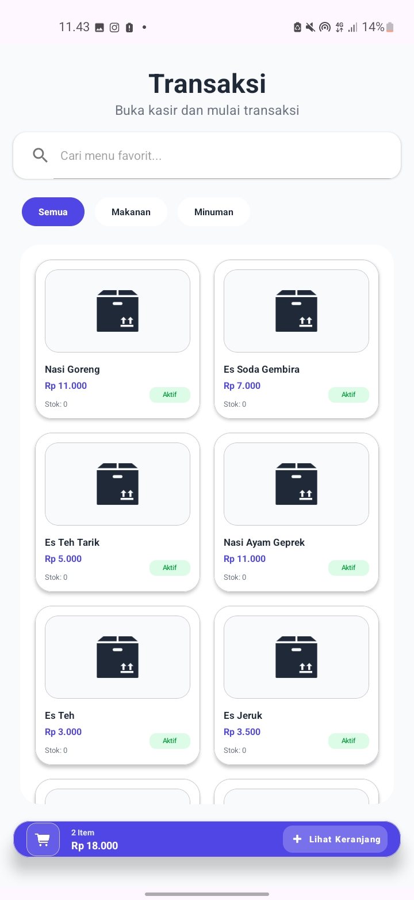
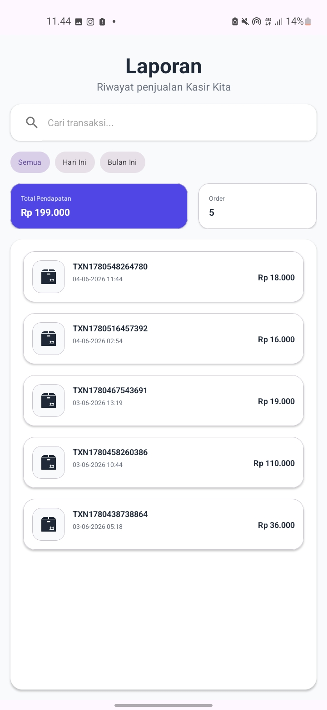
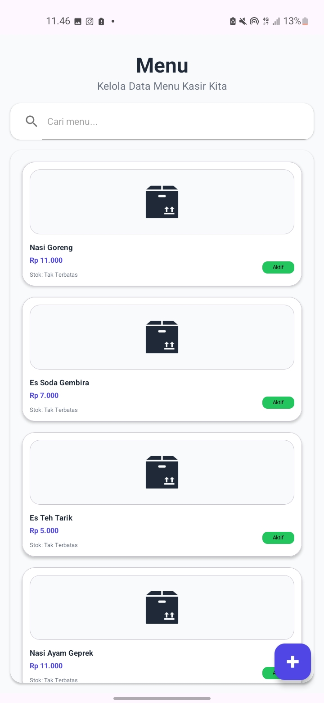

# 🛒 Kasir Kita - Sales Application

**Kasir Kita** adalah aplikasi Point of Sale (POS) berbasis Android yang dirancang untuk membantu UMKM mengelola penjualan, stok barang, dan laporan keuangan secara real-time. Aplikasi ini terintegrasi dengan **Firebase Realtime Database** dan mendukung **Printer Thermal Bluetooth**.

---

## 📸 Screenshot Aplikasi

| Halaman Login | Dashboard Utama | Keranjang Belanja |
|:---:|:---:|:---:|
|  |  |  |

| Proses Checkout | Struk Digital | Laporan Penjualan |
|:---:|:---:|:---:|
|  |  |  |

| Data Produk | Data Kategori | Data Cabang | Data Pegawai |
|:---:|:---:|:---:|:---:|
|  |  |  |  |

---

## ✨ Fitur Utama

*   **🔐 Shared-Password Authentication**: Login aman dengan password tunggal instansi dan verifikasi Nama Pegawai dari database.
*   **📦 Manajemen Inventaris**: Kelola data Produk, Kategori, Cabang, dan Pegawai secara CRUD.
*   **🛒 Sistem Transaksi**:
    *   Input Nama Pemesan & Uang Bayar.
    *   Auto-Stock Update (stok berkurang otomatis saat transaksi berhasil).
*   **📑 Laporan Penjualan**: Riwayat transaksi (Read-Only) dengan filter waktu (Hari ini/Bulan ini) dan ringkasan pendapatan.
*   **🖨️ Cetak Struk Bluetooth**: Mendukung printer thermal 58mm/80mm dengan library ESC/POS.
*   **🔄 Auto-Login Session**: Sesi login tersimpan otomatis di perangkat.

---

## 🚀 Teknologi yang Digunakan

*   **Bahasa**: Kotlin
*   **Database**: Firebase Realtime Database
*   **UI Framework**: Material Design 3
*   **Architecture**: ViewBinding & Firebase Integration
*   **Library Printer**: [ESCPOS-ThermalPrinter-Android](https://github.com/DantSu/ESCPOS-ThermalPrinter-Android)

---

## 🛠️ Cara Instalasi

**Clone Project**: `git clone https://github.com/alvaroow/Sales_Application.git`

---

